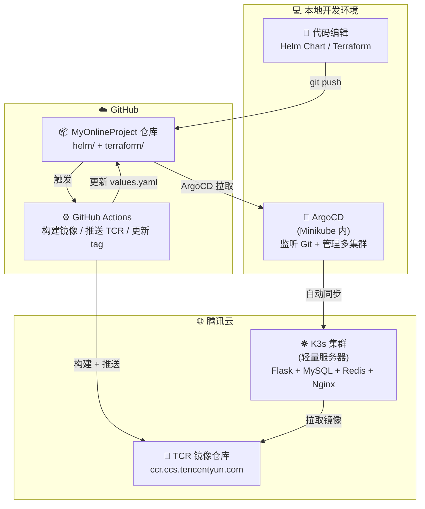
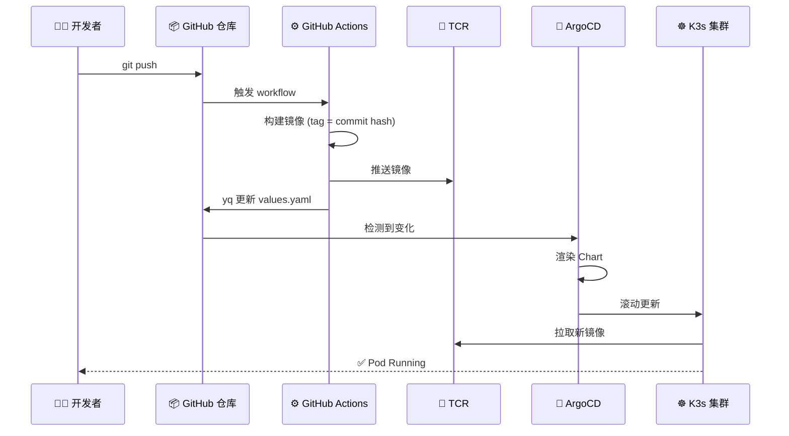

# MyOnlineProject

基于 Kubernetes 的云原生应用交付项目。涵盖 **Terraform 基础设施即代码** + **Helm 应用打包** + **ArgoCD GitOps 多集群管理** + **GitHub Actions CI/CD**。

---

## 🏗️ 架构总览



---

## 🛠️ 技术栈

| 层级 | 技术 | 用途 |
|:-----|:-----|:-----|
| **基础设施** | Terraform | 管理腾讯云 VPC / 子网 / 安全组 / CVM / TKE |
| **容器编排** | K3s（云上）、Minikube（本地） | 运行应用 |
| **应用打包** | Helm Chart | 模板化 K8s 资源 |
| **GitOps** | ArgoCD | 多集群自动同步 |
| **CI/CD** | GitHub Actions | 构建镜像、更新配置 |
| **镜像仓库** | TCR | 存储私有镜像 |
| **应用** | Flask + MySQL + Redis + RabbitMQ + Nginx | 业务服务 |
| **监控** | Prometheus + Grafana + Loki | 可观测性（按需开启） |

---

## 📁 目录结构

```
MyOnlineProject/
│
├── .github/workflows/          # CI/CD 流水线
│   ├── terraform-plan.yml      # Terraform 计划预览（push 触发）
│   ├── terraform-apply.yml     # Terraform 执行（手动 + 审批）
│   ├── terraform-destroy.yml   # Terraform 销毁（手动 + 审批）
│   ├── build-flask.yml         # Flask 镜像构建 + 推送 + 更新 tag
│   └── helm-lint.yml           # Helm Chart 校验
│
├── terraform/                  # 基础设施即代码
│   ├── modules/
│   │   ├── tencent-infra/      # VPC + 子网 + 安全组 + CVM
│   │   └── tke/                # TKE 集群 + 节点池
│   └── envs/
│       ├── dev/                # 开发环境配置
│       └── prod/               # 生产环境配置
│
├── helm/
│   └── myapp-tencent/          # 应用 Helm Chart
│       ├── Chart.yaml
│       ├── values.yaml         # 配置参数
│       ├── templates/
│       │   ├── default/        # Flask / MySQL / Redis / Nginx / RabbitMQ
│       │   └── monitoring/     # Prometheus / Grafana / Loki
│       └── others/             # 应用源码 + Dockerfile
│           ├── api/flask-app/
│           └── consumer/hello-consumer/
│
└── README.md
```

---

## 🚀 部署流程



**一句话总结**：开发者只需 `git push`，剩下全部自动化。

---

## 🔧 关键技术点

### 1. 多集群 GitOps

ArgoCD 部署在**本地 Minikube**，管理**云上 K3s** 集群：

```bash
# 注册 K3s 集群
argocd cluster add k3s --name k3s-cluster --insecure

# 创建 Application，指定目标集群
argocd app create myapp-tencent-k3s \
  --repo https://github.com/Decade920/MyOnlineProject.git \
  --path helm/myapp-tencent \
  --dest-server https://<K3s-IP>:6443 \
  --dest-namespace default \
  --sync-policy automated \
  --auto-prune \
  --self-heal
```

**为什么这样设计？**
- 2核2G 云主机装不下 ArgoCD（需 ~680MB）
- ArgoCD 在本地跑，不占云资源
- 学到多集群管理（简历加分）

---

### 2. 镜像仓库认证

TCR 是私有仓库，需要配置 `imagePullSecrets`：

```yaml
spec:
  template:
    spec:
      imagePullSecrets:          # 必须和 containers 同级
        - name: tcr-secret
      containers:
        - name: flask-app
          image: ccr.ccs.tencentyun.com/myapp-tencent/flask-app:v1
```

**关键坑**：`imagePullSecrets` 位置错了，K8s 会警告 `unknown field` 并忽略。

---

### 3. 资源限制

所有 Pod 配置 `requests` + `limits`，防止单 Pod 拖垮节点：

| 服务 | requests.memory | limits.memory | 依据 |
|:-----|:----------------|:--------------|:-----|
| Flask | 64Mi | 128Mi | 实测 33Mi |
| MySQL | 256Mi | 600Mi | 实测 350Mi |
| Redis | 32Mi | 128Mi | 实测 8Mi |
| Nginx | 32Mi | 64Mi | 实测 3Mi |

**原则**：`limits` 是实测值的 **1.5~2 倍**。

---

### 4. 模块开关

2核2G 内存不够跑全套，monitoring 一键关闭：

```yaml
# values.yaml
monitoring:
  allEnabled: false
```

模板里：

```yaml
{{- if .Values.monitoring.allEnabled }}
# 整个 monitoring 资源
{{- end }}
```

---

## ⚠️ 踩坑记录（真实经验）

### Kubernetes

| 坑 | 原因 | 解决 |
|:---|:-----|:-----|
| **StatefulSet 更新 spec 后 Pod 不重建** | StatefulSet 不会自动滚动更新 | 手动 `kubectl delete pod` 或 `rollout restart` |
| **imagePullSecrets 缩进错误** | 必须在 `spec.template.spec` 下，不能放进 `containers` | 调整缩进 |
| **2核2G 跑全套 OOM** | 全套应用 + 监控需 ~2.3G 内存 | 关掉监控和 RabbitMQ |
| **cluster_cidr 和子网重叠** | Pod 网络和节点网络不能重叠 | 改成 `172.16.0.0/16` |
| **探针刷计数器** | 探针访问 `/` 触发 `INCR` | 加独立的 `/health` 路由 |

### ArgoCD

| 坑 | 原因 | 解决 |
|:---|:-----|:-----|
| **CRD 注解超长** | K8s 注解限制 262144 字节 | `kubectl apply --server-side --force-conflicts` |
| **repo-server 无法访问 GitHub** | Pod 内无代理配置 | 注入 `HTTP_PROXY` / `HTTPS_PROXY` / `NO_PROXY` |
| **NodePort 不稳定** | Minikube docker 驱动下多层 NAT | 小请求可用，大文件用 `port-forward` |
| **Application 找不到集群** | `--dest-server` IP 和注册时不一致 | 核对 IP |

### CI/CD

| 坑 | 原因 | 解决 |
|:---|:-----|:-----|
| **sed 污染所有 tag** | `sed 's/tag:.*/.../'` 会替换全文 | 用 `yq eval ".path.to.tag = ..."` 精确修改 |
| **ArgoCD 同步后本地文件不更新** | ArgoCD 只同步集群，不碰本地文件 | 自己 `git pull` 看最新 |
| **Python print 不实时** | 容器内 stdout 有缓冲 | `print(..., flush=True)` 或 `python -u` |

### 云上 K3s

| 坑 | 原因 | 解决 |
|:---|:-----|:-----|
| **K3s 证书只签内网 IP** | 公网连接报 x509 错误 | kubeconfig 加 `insecure-skip-tls-verify: true` |
| **拉 DockerHub 镜像超时** | 国内网络限制 | 配置 `registries.yaml` 镜像加速 |
| **通配 DNS 被 EdgeOne 拦** | 腾讯云 WAF 拦截 nip.io | 用 NodePort 直连 |
| **TKE 机型不支持** | 节点池对机型有限制 | 用 `S5.MEDIUM4` 等通用机型 |

---

## 📈 后续规划

- [ ] 接入 Service Mesh（Istio 流量管理、金丝雀发布）
- [ ] 配置 HTTPS（Let's Encrypt + Cert-Manager）
- [ ] 部署到云上 TKE（替代 K3s）
- [ ] 混沌工程演练（Chaos Mesh）
- [ ] 云成本优化（FinOps）
- [ ] 建立 SLO / 错误预算

---

## 📄 License

MIT
